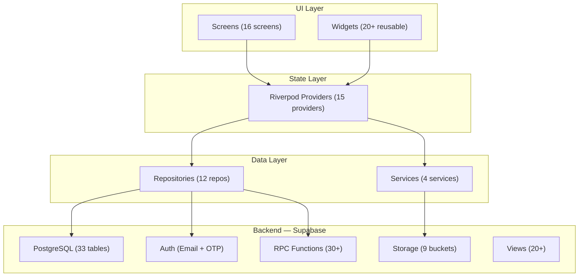
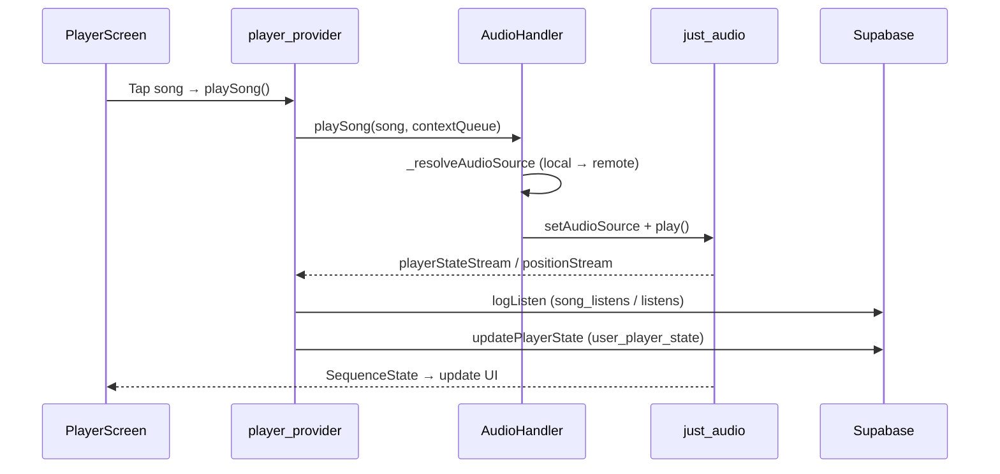
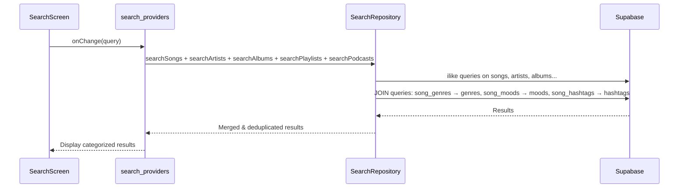
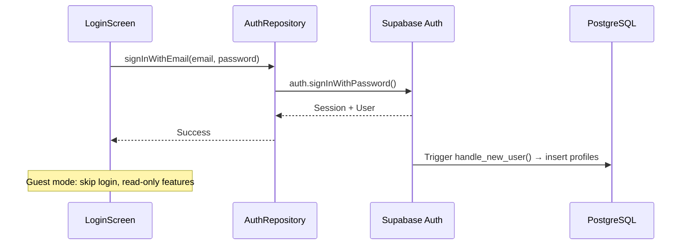
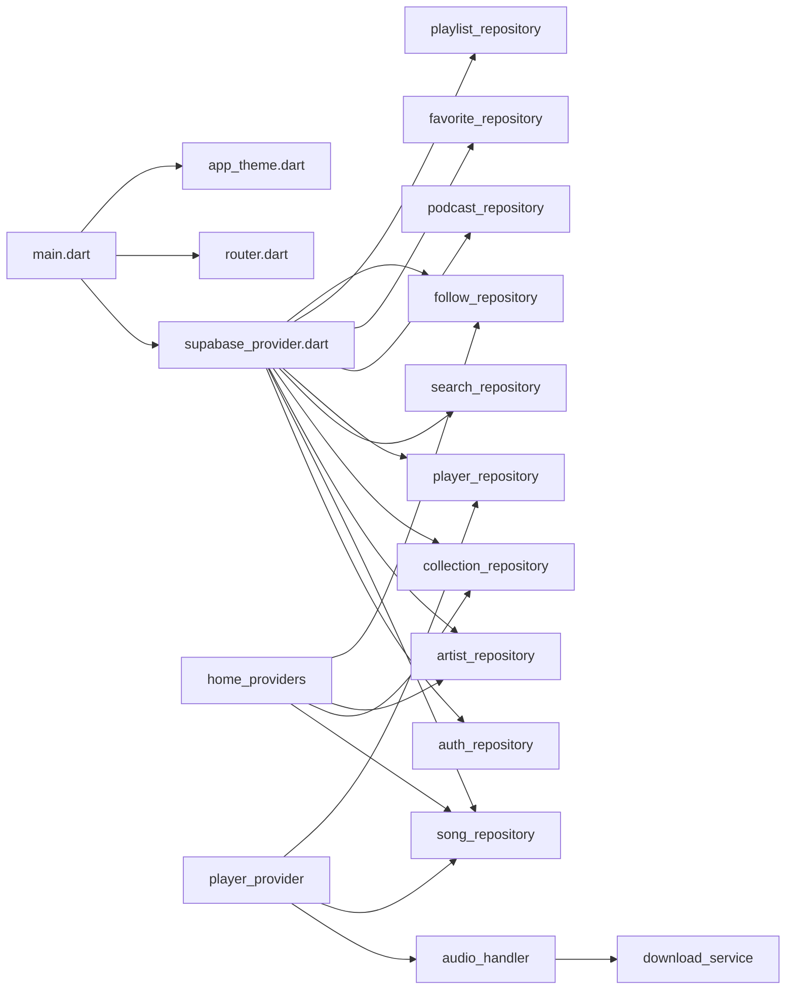

# 🎵 Flutter Music App — Báo cáo tổng quan dự án

## 1. Giới thiệu tổng quát

**Flutter Music App** là ứng dụng nghe nhạc và podcast trực tuyến đa nền tảng, lấy cảm hứng từ Spotify/YouTube Music. Ứng dụng sử dụng **Flutter + Dart** cho frontend và **Supabase (PostgreSQL)** cho toàn bộ backend (Database, Auth, Storage).

| Thông số | Giá trị |
|---|---|
| **Framework** | Flutter (Dart SDK ^3.10.7) |
| **State Management** | Riverpod 3.x |
| **Routing** | GoRouter 17.x |
| **Backend** | Supabase (PostgreSQL + Auth + Storage) |
| **Audio Engine** | just_audio + just_audio_background |
| **Platforms** | Web, Android, iOS, macOS, Linux, Windows |

---

## 2. Kiến trúc tổng thể



### Layered Architecture (Repository Pattern + Riverpod)

```
┌─────────────────────────────────────────────────────────────────┐
│  UI Layer          │ 16 screens + 20 widgets + auth screens    │
├─────────────────────────────────────────────────────────────────┤
│  Provider Layer    │ 15 Riverpod providers/notifiers            │
├─────────────────────────────────────────────────────────────────┤
│  Repository Layer  │ 12 repositories (data access → Supabase)   │
├─────────────────────────────────────────────────────────────────┤
│  Service Layer     │ AudioHandler, DownloadService, ShareService│
├─────────────────────────────────────────────────────────────────┤
│  Data/Model Layer  │ 11 Dart models + helpers                   │
└─────────────────────────────────────────────────────────────────┘
```

---

## 3. Cấu trúc thư mục chi tiết

```
lib/
├── main.dart                          # Entry point: Supabase init + JustAudio init
├── core/
│   ├── app_theme.dart                 # Dark theme (Spotify-inspired colors)
│   ├── router.dart                    # GoRouter config (ShellRoute + Auth routes)
│   ├── app_ui_utils.dart              # UI utility functions
│   ├── guest_guard.dart               # Guest mode access control
│   └── player_utils.dart              # Player helper utilities
├── models/                            # 11 data models
│   ├── song.dart                      # Song (id, title, audioUrl, coverUrl, lyricsUrl...)
│   ├── artist.dart                    # Artist (uuid id, name, avatar, followers, monthly listeners)
│   ├── album.dart                     # Album (bigint id, title, cover, release_date, type)
│   ├── playlist.dart                  # Playlist (user/system types)
│   ├── podcast.dart                   # Podcast episode
│   ├── podcast_channel.dart           # Podcast channel
│   ├── profile.dart                   # User profile
│   ├── collection_item.dart           # Unified model for Playlist/Album detail
│   ├── lyric_line.dart                # Single LRC lyric line
│   ├── lyrics_data.dart               # Full lyrics container
│   └── song_download.dart             # Offline download metadata
├── providers/                         # 15 Riverpod providers
│   ├── supabase_provider.dart         # Central DI: all repository providers
│   ├── auth_provider.dart             # Auth state stream
│   ├── player_provider.dart           # Audio playback state + Supabase sync
│   ├── home_providers.dart            # Home screen data (trending, artists, albums)
│   ├── search_providers.dart          # Multi-entity search state
│   ├── library_providers.dart         # Library (playlists, followed artists)
│   ├── podcast_providers.dart         # Podcast channels & episodes
│   ├── favorite_provider.dart         # Like/unlike songs
│   ├── lyrics_provider.dart           # Lyrics fetching
│   ├── lyrics_sync_provider.dart      # Real-time LRC sync
│   ├── download_provider.dart         # Download state management
│   ├── artist_detail_provider.dart    # Artist detail page data
│   ├── collection_detail_provider.dart# Playlist/Album detail
│   ├── create_playlist_provider.dart  # Playlist creation workflow
│   └── saved_playlists_provider.dart  # Saved playlists state
├── repositories/                      # 12 repositories
│   ├── song_repository.dart           # Songs CRUD (trending, by artist, random)
│   ├── artist_repository.dart         # Artists (detail, songs via junction, albums)
│   ├── collection_repository.dart     # Playlists & Albums (songs, save/unsave)
│   ├── search_repository.dart         # Multi-entity search (songs, artists, albums, podcasts, genres, moods, hashtags)
│   ├── auth_repository.dart           # Email auth (login, register, OTP, password reset)
│   ├── player_repository.dart         # Player state sync + listen history
│   ├── podcast_repository.dart        # Podcasts & channel subscriptions
│   ├── favorite_repository.dart       # Favorites (like/unlike)
│   ├── follow_repository.dart         # Artist following
│   ├── playlist_repository.dart       # User playlist management
│   ├── lyrics_repository.dart         # Lyrics fetching (LRC format)
│   └── offline_repository.dart        # Offline/download management
├── services/
│   ├── audio_handler.dart             # just_audio wrapper (queue, play, shuffle, loop)
│   ├── download_service.dart          # Dio-based MP3 download + SharedPrefs storage
│   ├── artist_service.dart            # Artist utility
│   └── share_service.dart             # share_plus integration
├── screens/                           # 16 screens
│   ├── main_screen.dart               # Shell (bottom nav + mini player)
│   ├── home_screen.dart               # Home (banners, trending, playlists, artists, podcasts)
│   ├── search_screen.dart             # Search (live suggestions, categories, trending keywords)
│   ├── library_screen.dart            # User library (playlists, liked songs, followed artists)
│   ├── player_screen.dart             # Full-screen player (artwork, controls, lyrics)
│   ├── artist_detail_screen.dart      # Artist profile (songs, albums, stats)
│   ├── collection_detail_screen.dart  # Unified playlist/album detail
│   ├── liked_songs_screen.dart        # Liked songs collection
│   ├── podcast_detail_screen.dart     # Podcast episode detail
│   ├── podcast_channel_screen.dart    # Podcast channel + episodes
│   ├── create_playlist_screen.dart    # Create/edit user playlist
│   ├── category_detail_screen.dart    # Genre/Mood category detail
│   ├── downloads_screen.dart          # Offline downloads
│   ├── lyrics_screen.dart             # Lyrics overlay
│   ├── full_lyrics_screen.dart        # Full lyrics page
│   └── auth/                          # 5 auth screens (login, register, forgot, OTP, reset)
├── widgets/                           # 20+ reusable widgets
│   ├── mini_player.dart               # Persistent mini player bar
│   ├── song_list_item.dart            # Song row with options
│   ├── playlist_card.dart             # Playlist grid card
│   ├── podcast_card.dart              # Podcast card
│   ├── artist_avatar_row.dart         # Artist avatar horizontal scroll
│   ├── lyrics_preview_card.dart       # Lyrics preview in player
│   ├── progress_bar.dart              # Audio progress bar
│   ├── user_drawer.dart               # Side drawer (profile, settings)
│   ├── player_options_bottom_sheet.dart# Song options bottom sheet
│   └── search/                        # 7 search sub-widgets
└── helpers/
    ├── local_recent_search_helper.dart # SharedPrefs-based local search history
    └── lyrics_parser.dart             # LRC file parser
```

---

## 4. Supabase Database — Schema & Mapping

### 4.1 Thống kê dữ liệu hiện tại (Live)

| Entity | Records | RLS |
|---|---|---|
| **profiles** | 4 | ✅ |
| **artists** | 53 | ✅ |
| **songs** | 60 | ✅ |
| **albums** | 8 | ✅ |
| **playlists** | 9 | ✅ |
| **podcasts** | 10 | ✅ |
| **podcast_channels** | 9 | ✅ |
| **genres** | 6 | ✅ |
| **moods** | 5 | ✅ |
| **hashtags** | 5 | ✅ |

### 4.2 Sơ đồ quan hệ database (ER Diagram)

```mermaid
erDiagram
    profiles ||--o{ favorites : "user_id"
    profiles ||--o{ playlists : "user_id"
    profiles ||--o{ user_followed_artists : "user_id"
    profiles ||--o{ user_saved_playlists : "user_id"
    profiles ||--o{ user_recent_items : "user_id"
    profiles ||--o{ user_preferred_genres : "user_id"
    profiles ||--o{ user_preferred_artists : "user_id"
    profiles ||--o{ user_disliked_songs : "user_id"
    profiles ||--o{ user_disliked_artists : "user_id"

    songs ||--o{ song_artists : "song_id"
    songs ||--o{ song_genres : "song_id"
    songs ||--o{ song_moods : "song_id"
    songs ||--o{ song_hashtags : "song_id"
    songs ||--o{ album_songs : "song_id"
    songs ||--o{ playlist_songs : "song_id"
    songs ||--o{ favorites : "song_id"
    songs ||--o{ listens : "song_id"

    artists ||--o{ song_artists : "artist_id"
    artists ||--o{ album_artists : "artist_id"
    artists ||--o{ user_followed_artists : "artist_id"

    albums ||--o{ album_songs : "album_id"
    albums ||--o{ album_artists : "album_id"

    playlists ||--o{ playlist_songs : "playlist_id"
    playlists ||--o{ user_saved_playlists : "playlist_id"

    genres ||--o{ song_genres : "genre_id"
    moods ||--o{ song_moods : "mood_id"
    hashtags ||--o{ song_hashtags : "hashtag_id"

    podcast_channels ||--o{ podcasts : "channel_id"
    podcast_channels ||--o{ channel_subscriptions : "channel_id"
    podcasts ||--o{ podcast_listens : "podcast_id"
    podcasts ||--o{ podcast_favorites : "podcast_id"

    home_sections ||--o{ home_section_items : "section_id"
```



### 4.3 Mapping: Dart Models ↔ Supabase Tables

| Dart Model | Supabase Table | PK Type | Key Fields |
|---|---|---|---|
| `Song` | `songs` | `bigint` (IDENTITY) | title, artist, audio_url, cover_url, lyrics_url, duration_seconds |
| `Artist` | `artists` | `uuid` | name, avatar_url, cover_url, bio, verified, followers_count_cache |
| `Album` | `albums` | `bigint` (IDENTITY) | title, cover_url, release_date, album_type |
| `Playlist` | `playlists` | `bigint` (IDENTITY) | name, cover_url, playlist_type (system/user), is_public |
| `Podcast` | `podcasts` | `uuid` | title, channel_id, audio_url, cover_url, duration_seconds |
| `PodcastChannel` | `podcast_channels` | `uuid` | name, avatar_url, subscriber_count |
| `Profile` | `profiles` | `uuid` | email, display_name, avatar_url, is_artist |
| `CollectionItem` | — (virtual) | — | Unified adapter for Playlist/Album in UI |
| `LyricLine` | — (parsed) | — | Parsed from .lrc files in Storage |
| `SongDownload` | — (local) | — | SharedPreferences-based offline metadata |

### 4.4 Junction Tables (Many-to-Many)

| Junction Table | Relationship | Extra Columns |
|---|---|---|
| `song_artists` | Song ↔ Artist | artist_order, role (primary/featured) |
| `song_genres` | Song ↔ Genre | — |
| `song_moods` | Song ↔ Mood | — |
| `song_hashtags` | Song ↔ Hashtag | — |
| `album_artists` | Album ↔ Artist | artist_order, role |
| `album_songs` | Album ↔ Song | track_number, disc_number |
| `playlist_songs` | Playlist ↔ Song | position |

### 4.5 Supabase Storage Buckets

| Bucket | Content | Used By |
|---|---|---|
| `song-files` | MP3 audio files | AudioHandler → just_audio |
| `song-covers` | Song cover art | CachedNetworkImage |
| `artist-avatars` | Artist profile images | ArtistDetailScreen |
| `artist-covers` | Artist banner images | ArtistDetailScreen |
| `album-covers` | Album cover art | CollectionDetailScreen |
| `playlist-covers` | Playlist cover art | CollectionDetailScreen |
| `podcast-files` | Podcast audio | AudioHandler |
| `podcast-covers` | Podcast cover art | PodcastCard |
| `lyrics-files` | LRC lyric files | LyricsRepository → LyricsParser |

### 4.6 Database RPC Functions (30+ functions)

Database sử dụng rất nhiều **SECURITY DEFINER** RPC functions cho business logic:

| Category | Functions |
|---|---|
| **User Actions** | `like_song`, `unlike_song`, `follow_artist`, `unfollow_artist`, `save_playlist`, `unsave_playlist`, `subscribe_channel`, `unsubscribe_channel` |
| **Tracking** | `record_song_listen`, `record_podcast_listen`, `record_search_keyword`, `mark_*_opened` |
| **Preferences** | `dislike_song`, `dislike_artist`, `undislike_song`, `undislike_artist` |
| **Player State** | `set_user_player_state`, `clear_user_player_state` |
| **Cache Management** | `handle_favorites_like_count`, `handle_followed_artists_cache`, `handle_song_artists_cache`, `handle_album_songs_cache`, `handle_playlist_songs_cache`, `handle_saved_playlists_cache` |
| **Analytics** | `ensure_artist_month_rollover`, `rollover_all_artists_monthly_stats`, `recalculate_*` |
| **Recent Activity** | `upsert_user_recent_item`, `handle_recent_searches_trending` |

### 4.7 Database Views (20+)

Views optimized for app consumption:
`v_songs_for_app`, `v_artists_for_app`, `v_albums_for_app`, `v_podcasts`, `v_home_sections_for_app`, `v_home_banners_for_app`, `v_player_state_for_app`, `v_recent_items_for_app`, `v_library_playlists_for_app`, `v_genres_for_app`, `v_moods_for_app`, `v_hashtags_for_app`, `v_trending_search_keywords_for_app`, `v_artist_details_for_app`, `v_album_details_for_app`, `v_song_details`, `v_songs_by_hashtag_for_app`, `v_recent_song_history_for_app`, `v_favorite_podcasts_for_app`, `v_recent_searches_for_app`

> **Lưu ý:** Hiện tại Flutter app **không sử dụng trực tiếp các views này** — repositories query trực tiếp các tables cơ bản. Đây là cơ hội để tối ưu performance bằng cách chuyển sang sử dụng views.

---

## 5. Data Flow — Các luồng dữ liệu chính

### 5.1 Luồng phát nhạc



### 5.2 Luồng tìm kiếm



### 5.3 Luồng xác thực



---

## 6. Thiết kế UI/UX

### 6.1 Theme System
- **Dark theme only** (Spotify-inspired)
- Background: `#121212`, Surface: `#181818`, Primary: `#1DB954`
- Typography: **Outfit** (headings) + **Inter** (body)
- Animations: `flutter_animate` package

### 6.2 Navigation Structure
```
ShellRoute (MainScreen: bottom nav + mini player)
├── / (HomeScreen) — tabs: All, Music, Following, Podcasts
├── /search (SearchScreen) — live suggestions + categories
├── /library (LibraryScreen) — playlists, liked, followed
├── /playlist/:id → CollectionDetailScreen
├── /album/:id → CollectionDetailScreen
├── /artist/:id → ArtistDetailScreen
├── /podcast/:id → PodcastDetailScreen
├── /podcast-channel/:id → PodcastChannelScreen
├── /liked-songs → LikedSongsScreen
├── /downloads → DownloadsScreen
└── /category/:id → CategoryDetailScreen

Full-screen routes (no shell):
├── /player → PlayerScreen (slide-up transition)
├── /create-playlist → CreatePlaylistScreen
├── /login, /register, /forgot-password, /verify-otp, /reset-password
```

---

## 7. Phân tích bảo mật (Supabase Security Advisors)

> ⚠️ Có **nhiều cảnh báo bảo mật** cần xử lý:

### 7.1 Lỗi nghiêm trọng (ERROR)

| Issue | Count | Detail |
|---|---|---|
| **Security Definer Views** | 20 | Tất cả views `v_*_for_app` đều dùng `SECURITY DEFINER` — bypass RLS policies của querying user |
| **RLS Disabled** | 1 | Table `podcast_favorites` chưa bật RLS |

### 7.2 Cảnh báo (WARN)

| Issue | Count | Detail |
|---|---|---|
| **Anon-callable SECURITY DEFINER functions** | 30+ | Tất cả RPC functions (`like_song`, `follow_artist`, v.v.) đều có thể gọi bởi `anon` role mà không cần đăng nhập |
| **Authenticated SECURITY DEFINER functions** | 30+ | Tương tự, cần review quyền EXECUTE |
| **Public bucket allows listing** | 1 | Bucket `avatars` cho phép liệt kê toàn bộ files |
| **Leaked password protection disabled** | 1 | Chưa bật kiểm tra mật khẩu bị lộ qua HaveIBeenPwned |

> **Khuyến nghị**: Nên revoke `EXECUTE` trên `anon` role cho các functions yêu cầu authentication, và chuyển views sang `SECURITY INVOKER`. Bật RLS cho `podcast_favorites`.

---

## 8. Đánh giá kỹ thuật — Điểm mạnh & Điểm cần cải thiện

### ✅ Điểm mạnh

1. **Kiến trúc rõ ràng**: Repository pattern + Riverpod providers tách biệt rõ UI / Logic / Data
2. **Database design chuyên nghiệp**: Sử dụng junction tables, cache columns, RPC functions, views — phức tạp nhưng đúng chuẩn
3. **Multi-entity search**: Tìm kiếm đa chiều (title, genre, mood, hashtag) với fallback handling
4. **Offline support**: Download songs via Dio, play from local file system
5. **Player state sync**: Debounced sync giữa just_audio và Supabase `user_player_state`
6. **LRC lyrics sync**: Real-time lyrics synchronization
7. **Guest mode**: Cho phép dùng app mà không cần đăng nhập
8. **Comprehensive auth flow**: Email + OTP + Password reset

### ⚠️ Điểm cần cải thiện

1. **Views không được sử dụng**: 20+ views `v_*_for_app` đã tạo nhưng repositories query trực tiếp tables → bỏ phí optimization
2. **`artistRepositoryProvider` bị khai báo 2 lần**: Trong cả `artist_repository.dart` (line 8) và `supabase_provider.dart` (line 34) — có thể gây conflict
3. **Search N+1 vấn đề**: `searchSongs()` gọi **4 queries riêng biệt** (title, genre, mood, hashtag) rồi merge — nên dùng 1 query hoặc full-text search
4. **Random song**: `fetchRandomSong()` fetch 50 songs rồi shuffle in-memory — nên dùng `ORDER BY random() LIMIT 1` trên server
5. **`songs.artist` denormalized**: Column `artist` (text) trong table `songs` lưu tên nghệ sĩ trùng với junction `song_artists` — có thể gây inconsistency
6. **Security gaps**: Như phân tích ở mục 7 — cần hardening ngay
7. **Không có unit tests**: Thư mục `test/` trống
8. **`player_provider.dart` có custom Rx class**: Tự implement `combineLatest3` thay vì dùng rxdart package

---

## 9. Thư mục DATA_APP

Chứa dữ liệu offline và scripts hỗ trợ:

```
DATA_APP/
├── database/
│   ├── schema.sql              # Full database schema (141 KB)
│   ├── data.sql                # Seed data (274 KB)
│   ├── auth_schema.sql         # Auth schema export
│   ├── auth_data.sql           # Auth data export
│   ├── history_schema.sql      # Listening history schema
│   ├── history_data.sql        # Listening history data
│   ├── roles.sql               # Database roles
│   └── changes_auth_storage.sql # Migration changes
├── functions/                  # Supabase Edge Functions (nếu có)
├── storage/                    # Storage bucket configs
├── project_meta/               # Project metadata
└── workdir/                    # Working directory
```

---

## 10. Dependency Graph



---

## 11. Công nghệ sử dụng chi tiết

| Thành phần | Package | Version | Mục đích |
|---|---|---|---|
| **Framework** | flutter | SDK ^3.10.7 | Cross-platform UI |
| **State Management** | flutter_riverpod | ^3.3.1 | Reactive state management |
| **Routing** | go_router | ^17.1.0 | Declarative routing with ShellRoute |
| **Backend** | supabase_flutter | ^2.12.2 | PostgreSQL + Auth + Storage |
| **Audio** | just_audio | ^0.10.5 | Audio playback engine |
| **Background Audio** | just_audio_background | ^0.0.1-beta.17 | Lock screen controls |
| **Progress Bar** | audio_video_progress_bar | ^2.0.3 | Audio seek bar |
| **Image Caching** | cached_network_image | ^3.4.1 | Network image caching |
| **Typography** | google_fonts | ^8.0.2 | Outfit + Inter fonts |
| **Icons** | lucide_icons | ^0.257.0 | Modern icon set |
| **Date/Time** | intl | ^0.20.2 | Date formatting |
| **Environment** | flutter_dotenv | ^6.0.0 | .env configuration |
| **Loading** | shimmer | ^3.0.0 | Shimmer loading effect |
| **Animations** | flutter_animate | ^4.5.2 | Micro-animations |
| **Sharing** | share_plus | ^12.0.2 | Content sharing |
| **HTTP** | dio | ^5.9.2 | File downloads |
| **File System** | path_provider | ^2.1.5 | Local file paths |
| **Local Storage** | shared_preferences | ^2.5.5 | Local data persistence |

---

## Tóm tắt

Đây là một **dự án học tập/nghiên cứu rất hoàn chỉnh** với kiến trúc backend phức tạp (30+ RPC functions, 20+ views, 33 tables) và frontend đã implement đầy đủ các tính năng cốt lõi của một music streaming app. Điểm nổi bật nhất là sự đầu tư vào database design với caching counters, junction tables, và RPC-based business logic. Cần chú ý khắc phục các vấn đề bảo mật và tối ưu hóa queries để sẵn sàng cho production.
